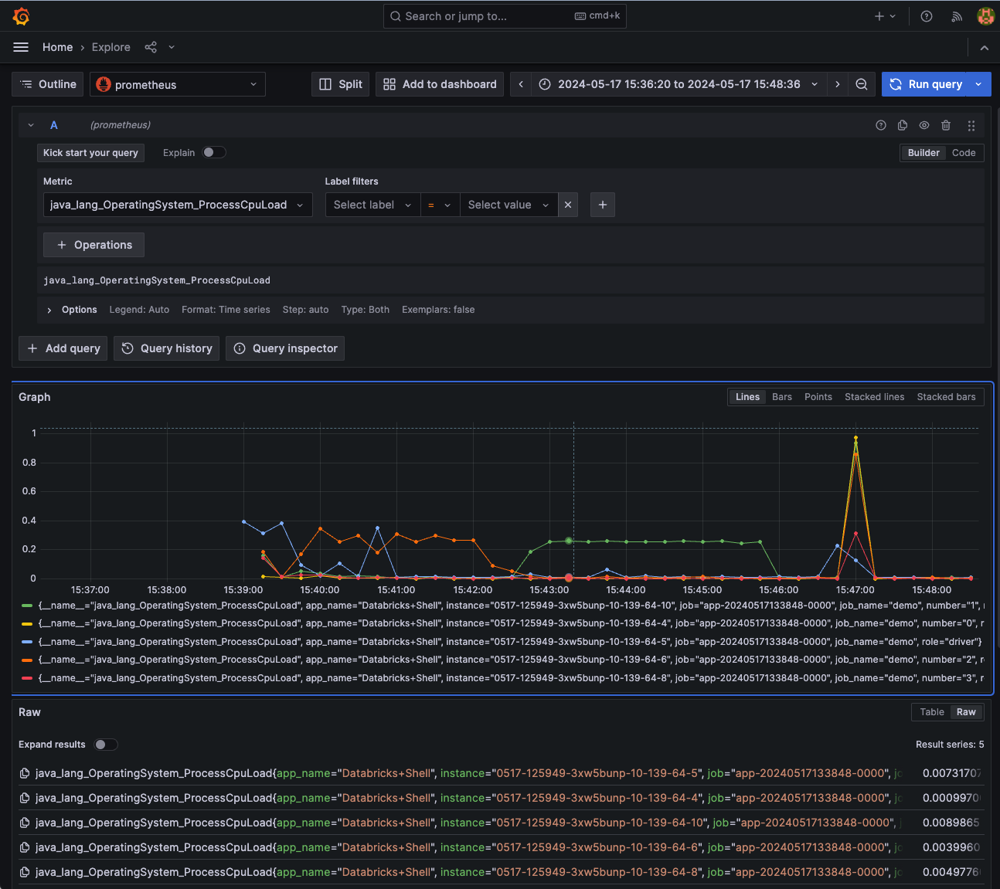

<!-- Improved compatibility of back to top link: See: https://github.com/othneildrew/Best-README-Template/pull/73 -->
<a name="readme-top"></a>
<!--
*** Thanks for checking out the Best-README-Template. If you have a suggestion
*** that would make this better, please fork the repo and create a pull request
*** or simply open an issue with the tag "enhancement".
*** Don't forget to give the project a star!
*** Thanks again! Now go create something AMAZING! :D
-->


<!-- PROJECT SHIELDS -->
<!--
*** I'm using markdown "reference style" links for readability.
*** Reference links are enclosed in brackets [ ] instead of parentheses ( ).
*** See the bottom of this document for the declaration of the reference variables
*** for contributors-url, forks-url, etc. This is an optional, concise syntax you may use.
*** https://www.markdownguide.org/basic-syntax/#reference-style-links
-->
[![Contributors][contributors-shield]][contributors-url]
[![Forks][forks-shield]][forks-url]
[![Stargazers][stars-shield]][stars-url]
[![Issues][issues-shield]][issues-url]
[![MIT License][license-shield]][license-url]
[![LinkedIn][linkedin-shield]][linkedin-url]


<!-- PROJECT LOGO -->
<br />
<div align="center">
<h3 align="center">Databricks Spark Observability Demo</h3>

  <p align="center">
    Monitoring and profiling Spark applications in Databricks with Prometheus, Grafana and Pyroscope
  </p>
</div>

<!-- TABLE OF CONTENTS -->
<details>
  <summary>Table of Contents</summary>
  <ol>
    <li>
      <a href="#about-the-project">About The Project</a>
      <ul>
        <li><a href="#built-with">Built With</a></li>
      </ul>
    </li>
    <li>
      <a href="#getting-started">Getting Started</a>
      <ul>
        <li><a href="#prerequisites">Prerequisites</a></li>
        <li><a href="#installation">Installation</a></li>
      </ul>
    </li>
    <li><a href="#usage">Usage</a></li>
    <li><a href="#roadmap">Roadmap</a></li>
    <li><a href="#contributing">Contributing</a></li>
    <li><a href="#license">License</a></li>
    <li><a href="#contact">Contact</a></li>
    <li><a href="#acknowledgments">Acknowledgments</a></li>
  </ol>
</details>


<!-- ABOUT THE PROJECT -->
## About The Project
Dive deeply into performance details and uncover what Spark Execution Plan doesn't typically show.

![Product Name Screen Shot][product-screenshot]

<p align="right">(<a href="#readme-top">back to top</a>)</p>

### Built With

[![Databricks][Databricks.com]][Databricks-url]
[![Prometheus][Prometheus.com]][Prometheus-url]
[![Grafana][Grafana.com]][Grafana-url]
[![Pyroscope][Pyroscope.com]][Pyroscope-url]
[![Spark][Spark]][Spark-url]

<p align="right">(<a href="#readme-top">back to top</a>)</p>


<!-- GETTING STARTED -->
## Getting Started
This project demonstrates how to monitor and profile Spark applications in Databricks using Prometheus, Grafana and Pyroscope. This is applicable to any Spark application running on Databricks, including batch, streaming, and interactive workloads (including ephemeral Jobs).

Besides Prometheus, Pyroscope and Grafana, this project will create a small single-node Spark Cluster and a set of init scripts to configure it to push metrics to Prometheus Pushgateway and Pyroscope.

### Prerequisites

This demo uses [Terraform](https://www.terraform.io/) to create all necessary resources in your Databricks Workspace. You will need Terraform version 1.40 or later installed on your machine.

You'll also need a VM with the network connectivity to the Databricks Workspace. This VM should preferably be created in the same virtual network as the Databricks Workspace, or the peered network. 

#### Databricks

You will need a Databricks account to run the demo if you don't have one already. You can sign up for a free account at [https://databricks.com/try-databricks](https://databricks.com/try-databricks).

#### Tooling

In order to send metrics and traces to Prometheus and Pyroscope, they need to be set up and running. For the convenience of the demo, the complete setup is done using Docker Compose, which you can find in [docker](docker) directory. The included Terraform configuration won't create these resources for you, so you will need to set them up.

It can be started with the following command:
```sh
docker compose up
```

### Setup
You will need a Databricks [Personal Access Token](https://docs.databricks.com/dev-tools/api/latest/authentication.html#generate-a-token) to run the demo. Once you have the token, you can create a profile in the Databricks CLI or configure the [provider](provider.tf) explicitly (using PAT or any other form of authentication).

<p align="right">(<a href="#readme-top">back to top</a>)</p>


<!-- USAGE EXAMPLES -->
## Usage

Terraform setup has only two variables that need to be set, we can provide them through Environment (or through a file), making sure to replace the values with the actual ones:

```sh
export TF_VAR_prometheus_pushgateway_host={pushgateway_host}:9091
export TF_VAR_pyroscope_host={prometheus_host}:4040
```

### Prometheus Demo
If configured, you'll be able to see all relevant metrics in Grafana. If you're using tagging, you are also able to filter by cluster, job, and other tags.

The example below shows the CPU usage of each executor in the Spark cluster.



### Pyroscope Demo
If set correctly, here's what you should get at the end. The following example demonstrates profiling a Spark application that is bottlenecked by reading `lzw` compressed files, as well as using `regex` to process the data.


<p align="right">(<a href="#readme-top">back to top</a>)</p>


<!-- LICENSE -->
## License

Distributed under the MIT License. See `LICENSE.txt` for more information.

<p align="right">(<a href="#readme-top">back to top</a>)</p>

<!-- CONTACT -->
## Contact

Project Link: [https://github.com/rayalex/spark-databricks-observability-demo](https://github.com/github_username/repo_name)

<p align="right">(<a href="#readme-top">back to top</a>)</p>

<!-- MARKDOWN LINKS & IMAGES -->
<!-- https://www.markdownguide.org/basic-syntax/#reference-style-links -->
[contributors-shield]: https://img.shields.io/github/contributors/rayalex/spark-databricks-observability-demo.svg?style=for-the-badge
[contributors-url]: https://github.com/rayalex/spark-databricks-observability-demo/graphs/contributors
[forks-shield]: https://img.shields.io/github/forks/rayalex/spark-databricks-observability-demo.svg?style=for-the-badge
[forks-url]: https://github.com/rayalex/spark-databricks-observability-demo/network/members
[stars-shield]: https://img.shields.io/github/stars/rayalex/spark-databricks-observability-demo.svg?style=for-the-badge
[stars-url]: https://github.com/rayalex/spark-databricks-observability-demo/stargazers
[issues-shield]: https://img.shields.io/github/issues/rayalex/spark-databricks-observability-demo.svg?style=for-the-badge
[issues-url]: https://github.com/rayalex/spark-databricks-observability-demo/issues
[license-shield]: https://img.shields.io/github/license/rayalex/spark-databricks-observability-demo.svg?style=for-the-badge
[license-url]: https://github.com/rayalex/spark-databricks-observability-demo/blob/master/LICENSE.txt
[linkedin-shield]: https://img.shields.io/badge/-LinkedIn-black.svg?style=for-the-badge&logo=linkedin&colorB=555
[linkedin-url]: https://linkedin.com/in/aleksandar-dragojevic/
[product-screenshot]: img/pyroscope.png
[Next.js]: https://img.shields.io/badge/next.js-000000?style=for-the-badge&logo=nextdotjs&logoColor=white
[Next-url]: https://nextjs.org/
[React.js]: https://img.shields.io/badge/React-20232A?style=for-the-badge&logo=react&logoColor=61DAFB
[React-url]: https://reactjs.org/
[Vue.js]: https://img.shields.io/badge/Vue.js-35495E?style=for-the-badge&logo=vuedotjs&logoColor=4FC08D
[Vue-url]: https://vuejs.org/
[Angular.io]: https://img.shields.io/badge/Angular-DD0031?style=for-the-badge&logo=angular&logoColor=white
[Angular-url]: https://angular.io/
[Svelte.dev]: https://img.shields.io/badge/Svelte-4A4A55?style=for-the-badge&logo=svelte&logoColor=FF3E00
[Svelte-url]: https://svelte.dev/
[Laravel.com]: https://img.shields.io/badge/Laravel-FF2D20?style=for-the-badge&logo=laravel&logoColor=white
[Laravel-url]: https://laravel.com
[Bootstrap.com]: https://img.shields.io/badge/Bootstrap-563D7C?style=for-the-badge&logo=bootstrap&logoColor=white
[Bootstrap-url]: https://getbootstrap.com
[JQuery.com]: https://img.shields.io/badge/jQuery-0769AD?style=for-the-badge&logo=jquery&logoColor=white
[JQuery-url]: https://jquery.com
[Databricks.com]: https://img.shields.io/badge/Databricks-FF2D20?style=for-the-badge&logo=databricks&logoColor=white
[Databricks-url]: https://databricks.com
[Prometheus.com]: https://img.shields.io/badge/Prometheus-000000?style=for-the-badge&logo=prometheus&logoColor=E6522C
[Prometheus-url]: https://prometheus.io
[Grafana.com]: https://img.shields.io/badge/Grafana-F46800?style=for-the-badge&logo=grafana&logoColor=white
[Grafana-url]: https://grafana.com
[Pyroscope.com]: https://img.shields.io/badge/Pyroscope-FF2D20?style=for-the-badge&logo=pyroscope&logoColor=white
[Pyroscope-url]: https://pyroscope.io
[Spark]: https://img.shields.io/badge/Apache_Spark-E25A1C?style=for-the-badge&logo=apache-spark&logoColor=white
[Spark-url]: https://spark.apache.org
